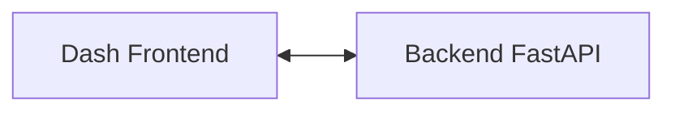

# Attractors take 3
Hey so a long time ago i found this https://examples.holoviz.org/attractors/attractors.html project and thought it looked really cool so i played around with it and wanted to turn it into a rest api.

It was a super cool demo learned about jit and datashaders
TODO thank the guy that gave the talk scaling open source science.

It going to make me pretty pictures and the server will be a good test service for other things.

# dev containers and CodeSpaces
going to learn to use the .devcontainers

so im now in a clean 3.11 dev container :) I have a bash terminal

Cool so i updated my pre-commit hooks as well

Im running without a venv bc im already in a clean room. This is great now I can install all my dev dependencies and then make a clean .venv with only whats needed to deploy.

## Issues
- How can i set the default shell to zsh? it is an option
- Can't build or run Dockerfile in the container.
possibly I could pass the local machines docker into the container
```bash
ls -la /var/run/docker.sock
docker run -v /var/run/docker.sock:/var/run/docker.sock -it your-dev-container-image
```

- I'm running redis on port 6379 but i cant connect to it bc im in a container
    - ok so i had to do this
    ```bash
    docker network create my_network
    # re run a new redis instance with the --network
    docker run --name my_redis_container --network my_network -p 6379:6379 -d redis
    # i had to also add my_network to the build args of this in devcontainer.json
    ```
- super strange git issue
```
git add src/
fatal: detected dubious ownership in repository at '/workspaces/attractorsIII'
To add an exception for this directory, call:

        git config --global --add safe.directory /workspaces/attractorsIII
```


# Deploying
- I created a new GCP project geo-attractors.
- I enabled `Cloud Run Admin API has been enabled` by going to it and clicking create service
- Maybe i want it in Kubernetes :thinking: just with the prometheus and grafana. (maybe redis)
- Maybe i first get it in cloud run to show people then bring it to gke

- starting with cloud run made some terraform and some startup scripts
had to send it to gcloud to build 1. on the m1 mac the build is strange and 2. can't build in the docker container
`gcloud builds submit --tag "us-central1-docker.pkg.dev/geo-attractors/attractors/attractors-backend"`
this will be solved when its just automatic with the ci/cd pipeline thats totally coming soon


- wow that was kinda super easy like i did it in under an hour service account artifact registry public cloud run and all (thanks copilot <3)

- I never saved the terraform.tfstate
    - `gsutils mb gs://geo-attractors-tf`
    - added backend to main.tf then did a `terraform init`


# two services one repo
each service will have its own venv and requirements.txt. But the requirements.txt in the root of this project will have all the dev dependencies need to run pre-commit hooks and any other project dependencies.




# GH workload federation stuff

[Here is the module I used](https://github.com/terraform-google-modules/terraform-google-github-actions-runners/blob/master/modules/gh-oidc/README.md
)

- need to enable IAM Service Account Credentials API

- two variables need to be set you get them after applying the terraform and then running `terraform output` and then use the value from the outputs
`gh_federation_provider_name and gh_federation_sa_email`
```bash
gh secret set WIF_PROVIDER -b"gh_federation_provider_name"
gh secret set WIF_SERVICE_ACCOUNT -b"gh_federation_sa_email"
```
